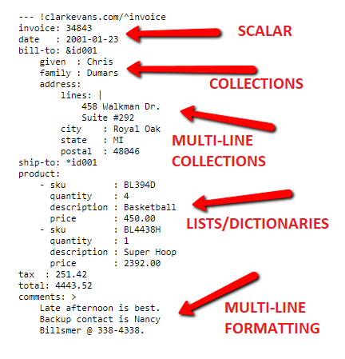

# Lenguaje de marca YAML

## ¿Qué es YAML?
YAML es un formato de serialización de datos diseñado para mejorar la legibilidad y facilidad de escritura en comparación con JSON. Ofrece soporte para varios tipos de datos y es compatible con numerosos lenguajes de programación, como JavaScript, Python y Java.

## ¿Qué es un archivo YAML?
Un archivo YAML es un documento que utiliza el lenguaje YAML (*YAML Ain't Markup Language*), una forma de serialización de datos basada en Unicode. Se utiliza para configuraciones, mensajería en Internet y persistencia de objetos. YAML se caracteriza por su sintaxis independiente del lenguaje de programación y su enfoque en la legibilidad humana.

## Formato de archivo YAML
- **Escalares:** Valores como cadenas, enteros, booleanos, etc.
- **Secuencias:** Listas que comienzan con un guión (-), permitiendo anidaciones.
- **Asignaciones:** Claves con valores que proporcionan flexibilidad en la estructura.

## Sintaxis básica de YAML
- Inicia con `---`.
- Utiliza el mapeo clave: valor.
- Admite tipos de datos como caracteres, cadenas, números enteros, floats y colecciones.

## Tipos de datos en YAML
- Booleanos (verdadero o falso).
- Float para números decimales.
- Nulo para valores nulos.
- Cadenas que pueden ser multilínea.
- Listas y anidaciones de listas.

# James
- Boy: yes
- GPA: 3.41

# Harry
- Male: FALSE
- GPA: 3.61
- Issues: NULL
- Name: "HARRY"
- Age: 16

# About
> Hello, this is Ryan
> From Alabama and I like to
> Play soccer.

# Fruits
- Apple
- Banana
- Guava

# Automobiles
## Car
- Hyundai
- Volkswagen
- Ford

# Subjects
## Engineering
### Mechanical Engineering
- Design and manufacture
- Automobile
- Control and Design

### Civil Engineering
- Structural en

<!-- -->

## Bibliografía

- [Documentación de formato de archivo YAML](https://docs.fileformat.com/es/programming/yaml/)
- [¿Qué es YAML? ](https://geekflare.com/es/what-is-yaml/#geekflare-toc-basic-yaml-syntax))

# Qué es un archivo JSON

Un archivo JSON es un archivo de texto que sigue la sintaxis de JSON (JavaScript Object Notation), que es un formato ligero de intercambio de datos. Un archivo JSON típicamente contiene datos estructurados en una serie de pares de clave-valor, separados por comas y encerrados entre llaves {}. Cada par de clave-valor se compone de una clave que es una cadena y un valor que puede ser un objeto, un array, un número, una cadena, un valor booleano o nulo.

Los archivos JSON son utilizados para intercambiar datos entre sistemas heterogéneos de manera eficiente y rápida, ya que son fácilmente interpretados y generados por muchos lenguajes de programación. Además, los archivos JSON son fáciles de leer y escribir por los humanos, lo que los hace útiles para configuraciones y archivos de datos legibles por máquina y humanos.

## Para qué se utiliza JSON

JSON se utiliza para transmitir datos estructurados entre una aplicación cliente y un servidor. Por ejemplo, un cliente web podría utilizar JSON para solicitar datos de un servidor web. El servidor puede entonces responder con una respuesta JSON que contiene los datos solicitados.

JSON también se utiliza en la creación de servicios web y APIs (Application Programming Interfaces). Una API es un conjunto de reglas, protocolos y herramientas que se utilizan para crear software y aplicaciones. JSON es un formato de datos comúnmente utilizado en las respuestas de las APIs, lo que permite a los desarrolladores crear aplicaciones que interactúen con otros sistemas.

## Cómo funciona el formato JSON

JSON es un formato de texto plano que se puede leer y escribir fácilmente. Los datos se almacenan en un archivo de texto plano con la extensión .json. Los datos en formato JSON se pueden leer en cualquier lenguaje de programación, lo que lo hace muy útil para la transmisión de datos entre diferentes sistemas.

Cuando se envían datos en formato JSON desde un servidor a un cliente, el servidor serializa los datos en formato JSON antes de enviarlos. El cliente luego utiliza un analizador JSON para convertir los datos JSON en objetos y arrays que se pueden utilizar en la aplicación.

## Ventajas de JSON

1. **Fácil de leer y escribir:** JSON es un formato de texto plano que es fácil de leer y escribir para los humanos. Es mucho más legible que otros formatos como XML.
2. **Ligero:** JSON es un formato ligero que no requiere mucho ancho de banda para transmitir datos. Esto lo hace muy útil en aplicaciones web y móviles, donde la velocidad de descarga es importante.
3. **Interoperabilidad:** JSON es compatible con una amplia variedad de lenguajes de programación, lo que lo hace útil para la transmisión de datos entre diferentes sistemas.
4. **Fácil de analizar:** JSON es fácil de analizar en cualquier lenguaje de programación, lo que permite a los desarrolladores crear aplicaciones que interactúen con otros sistemas.

## Diferencias de JSON con otros lenguajes

JSON tiene algunas diferencias significativas con otros lenguajes de programación:

1. **Sintaxis:** La sintaxis de JSON es muy diferente de otros lenguajes de programación, lo que la hace fácil de leer y escribir. JSON utiliza llaves y corchetes para denotar objetos y arrays, respectivamente, y los datos se separan con comas.
2. **Tipos de datos:** JSON es un formato de datos más limitado que otros lenguajes de programación como JavaScript. JSON admite solo un conjunto limitado de tipos de datos, incluidos cadenas, números, booleanos, nulos, objetos y arrays. No admite tipos de datos más complejos como funciones o clases.
3. **Orientación a objetos:** JSON no es un lenguaje orientado a objetos como otros lenguajes de programación. En cambio, se centra en la representación de datos estructurados y su intercambio entre aplicaciones.
4. **Interactividad:** JSON no es un lenguaje interactivo como otros lenguajes de programación. En su lugar, se utiliza principalmente para transferir datos entre aplicaciones web y servicios web.
5. **Funcionalidades:** JSON no tiene la capacidad de realizar acciones complejas como otros lenguajes de programación. Su principal funcionalidad es transferir datos de forma segura y eficiente.

## JSON para datos enriquecidos de Schema

JSON puede ser aplicado para describir datos estructurados, lo que permite que los motores de búsqueda comprendan mejor el contenido de una página web. Una forma popular de hacerlo es utilizando Schema.org, un vocabulario comúnmente utilizado para etiquetar información estructurada en la web.

Con JSON-LD (JSON for Linking Data), una de las formas en que se puede implementar Schema.org, los datos estructurados se pueden integrar directamente en el HTML de una página web sin alterar la apariencia visual del sitio. En lugar de utilizar etiquetas HTML personalizadas, los datos se representan como un objeto JSON dentro de un script en el head de la página.

Por ejemplo, si un sitio web tiene una página de productos, podría usar JSON-LD para etiquetar el nombre del producto, la descripción, el precio, la marca y otros detalles. De esta manera, los motores de búsqueda pueden entender mejor el contenido de la página y mejorar la presentación de los resultados de búsqueda.

**Fuente:** [Aula CM - JSON: qué es y para qué sirve](https://aulacm.com/que-es/json-para-que-sirve-significado-definicion/)

